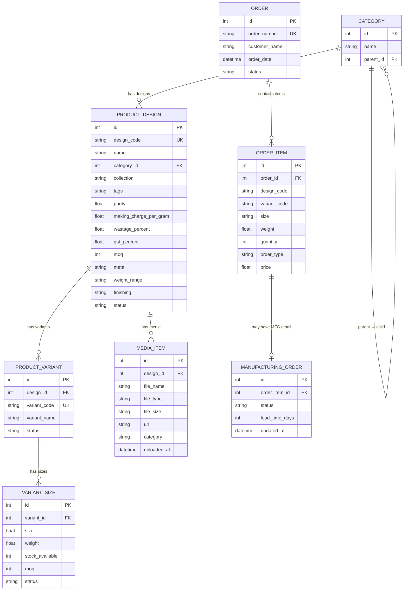
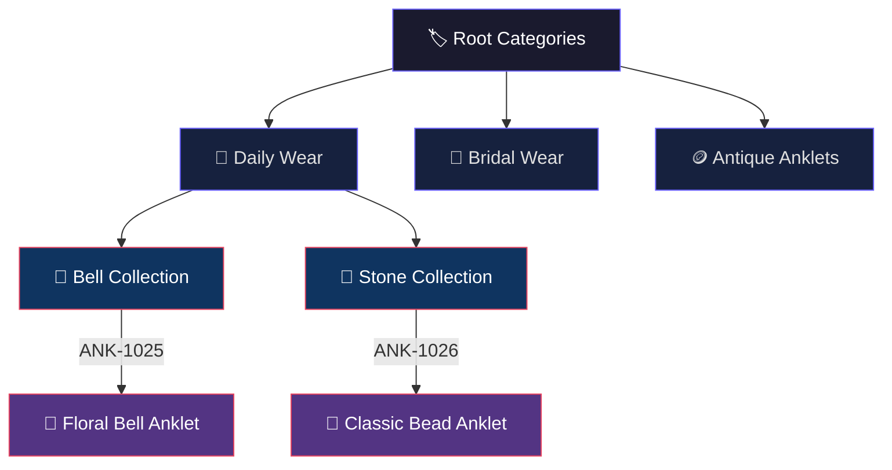
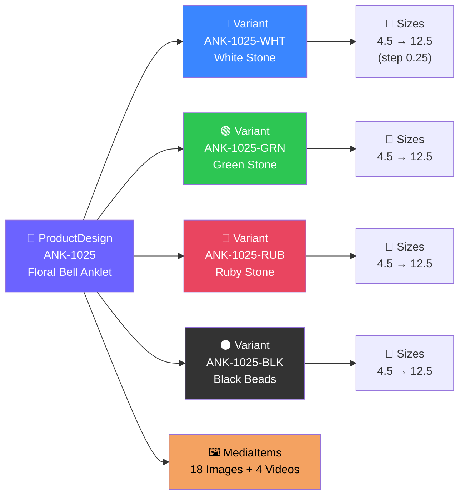
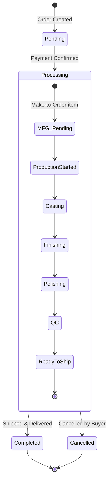
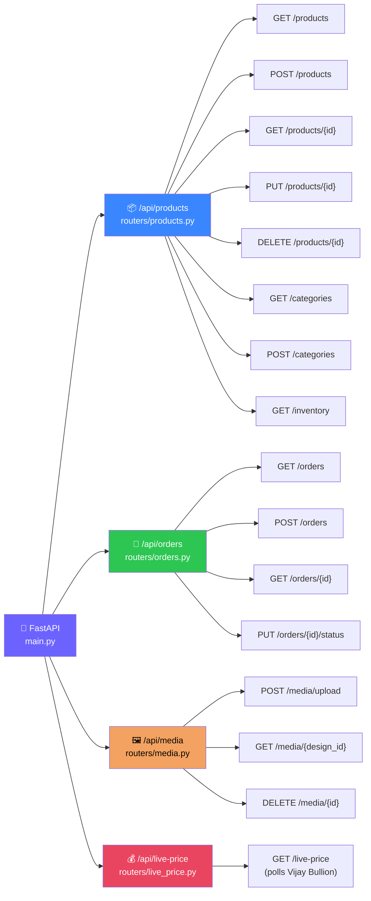
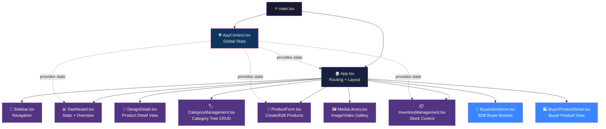
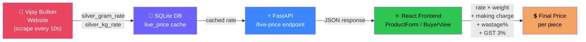
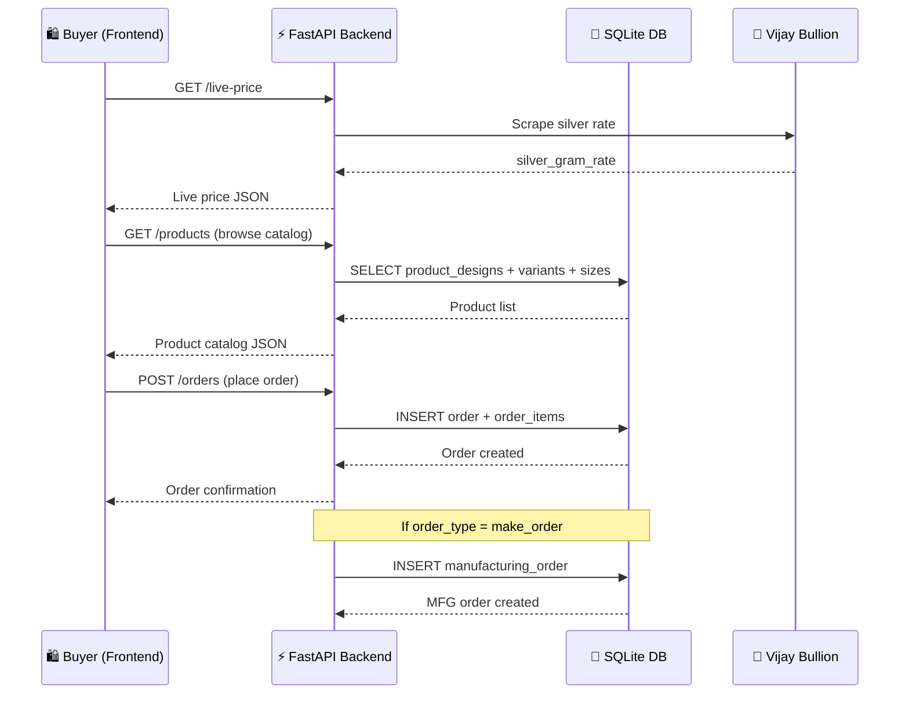
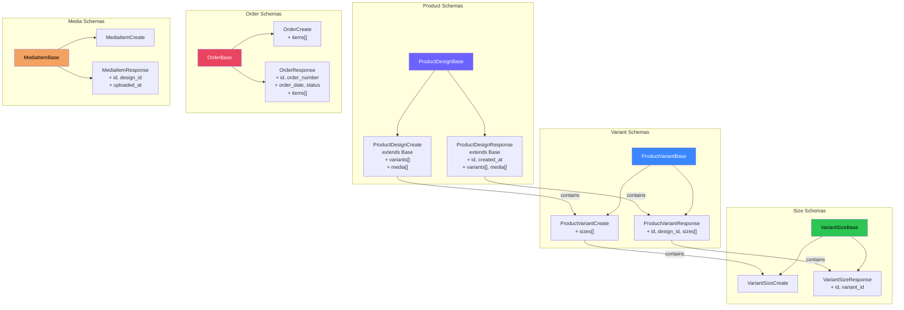

# 🏪 SR Chains — Ecommerce Project Graph

> **Project:** SR Chains Wholesale B2B Silver Jewelry Platform  
> **Stack:** FastAPI + SQLite + React (TypeScript) + Vite + TailwindCSS  
> Tags: #ecommerce #fastapi #react #b2b #silver #jewelry

---

## 📁 Project Structure

```
ecommerce/
├── backend/          → [[Backend]]
│   └── app/
│       ├── main.py         → [[Main Entry]]
│       ├── database.py     → [[Database]]
│       ├── models/         → [[DB Models]]
│       ├── routers/        → [[API Routers]]
│       └── schemas/        → [[Pydantic Schemas]]
└── frontend/         → [[Frontend]]
    └── src/
        ├── App.tsx         → [[App Root]]
        ├── components/     → [[UI Components]]
        └── context/        → [[App Context]]
```

---

## 🗄️ Database Models — ER Diagram



---

## 🌳 Category Tree



---

## 🔗 Product Design → Variant → Size Chain



---

## 🛒 Order Flow



---

## 🌐 API Routes Map



---

## ⚛️ Frontend Component Tree



---

## 💰 Live Price Calculation Flow



---

## 🔄 Full Data Flow — End to End



---

## 🗂️ Pydantic Schema Hierarchy



---

## 🔑 Key Concepts & Links

| Concept | Description | Related Files |
|---|---|---|
| [[Category]] | Self-referencing tree (parent → child) | `models/models.py` |
| [[ProductDesign]] | Core product entity with pricing rules | `models/models.py` |
| [[ProductVariant]] | Color/style variation of a design | `models/models.py` |
| [[VariantSize]] | Size + weight + stock per variant | `models/models.py` |
| [[MediaItem]] | Images & videos linked to a design | `models/models.py` |
| [[Order]] | Customer order header | `models/models.py` |
| [[OrderItem]] | Line item in an order | `models/models.py` |
| [[ManufacturingOrder]] | Make-to-order tracking | `models/models.py` |
| [[LivePrice]] | Real-time silver price from Vijay Bullion | `routers/live_price.py` |
| [[AppContext]] | Global React state (cart, products, etc.) | `context/AppContext.tsx` |

---

## 📌 Tags

#backend #frontend #database #fastapi #react #sqlite #b2b #jewelry #silver #anklets #ecommerce #sr-chains
